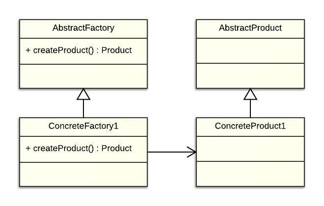
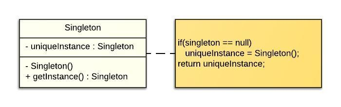
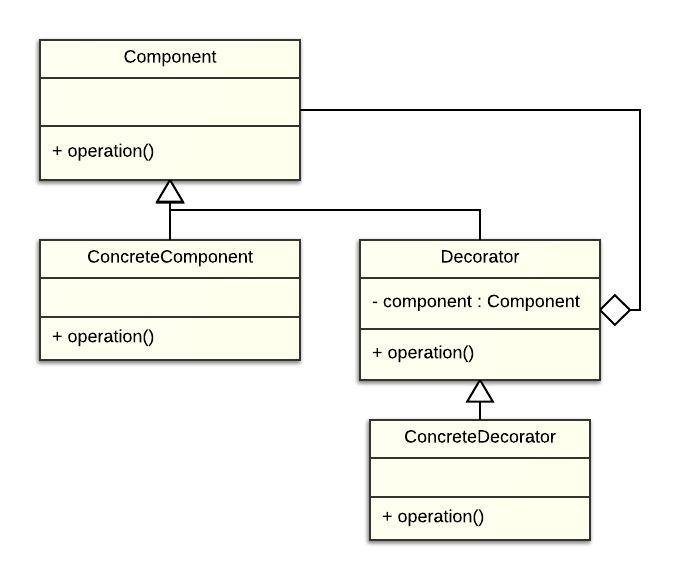

# Design patterns Cookbook

## Usage

You can pull the entire project to retrieve every patterns examples, or simply check in the pattern folder. 

**Every pattern's main class (containing the main method) use this format : #name#Pattern (e.g factoryPattern)**

More pattern examples are still under development :)

## What's a design pattern ?

In software engineering, a software design pattern is a general reusable solution to a commonly occurring problem within a given context in software design. 

It is not a finished design that can be transformed directly into source or machine code. It is a description or template for how to solve a problem that can be used in many different situations. Design patterns are formalized best practices that the programmer can use to solve common problems when designing an application or system.

## Design patterns in the project

### Creational

#### Factory design pattern

[link to package](DesignPatterns/src/com/zelia/factory)
  - Creates objects without specifying the exact class to create
  - *Illustrated by a RTS units creation system*
  
 
  
#### Singleton design pattern

[link to package](DesignPatterns/src/com/zelia/singleton)
  - Restricts object creation for a class to only one instance
  - Using 3 different approaches (unsafe for threading, safe for threading and safe for threading using synchronized)
  
 

### Structural

#### Decorator pattern

[link to package](DesignPatterns/src/com/zelia/decorator)
  - Dynamically adds/overrides behaviour in an existing method of an object
  - Illustrated by a dessert + ingredient name and price printing
  
 
  
### Behavorial

#### Observer pattern

[link to package](DesignPatterns/src/com/zelia/observer)
  - An object, called the subject, maintains a list of its dependents, called observers, and notifies them automatically of any state changes. Used mainly for event handling
  - Illustrated by a GPS notifying display on position/precision changes

## What's next ?

- [x] Add relatives links in the readme
- [ ] Examples of the main [Gang of Four's](https://en.wikipedia.org/wiki/Design_Patterns) design patterns
- [ ] Populate the project's wiki with a definition & link of every design pattern (searching in packages is a pain)
- [ ] Add other languages (C#, C++, you call it)
